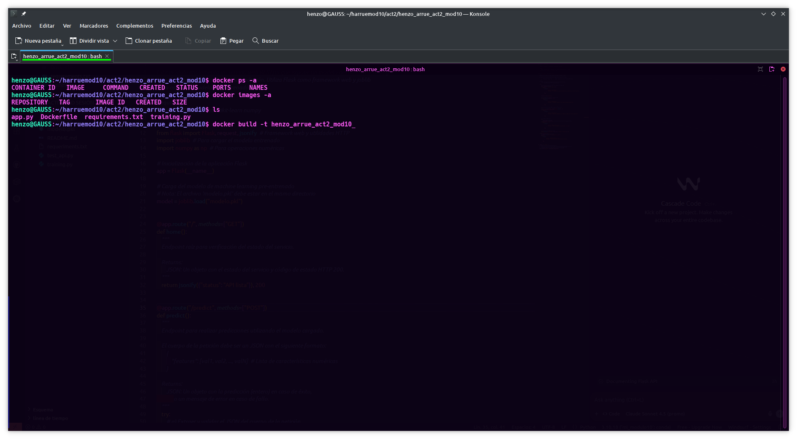
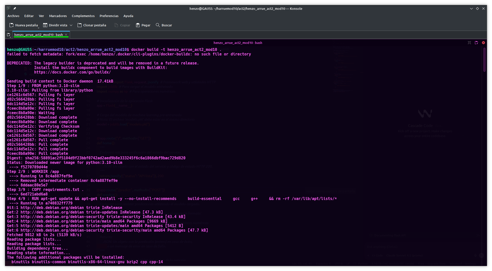
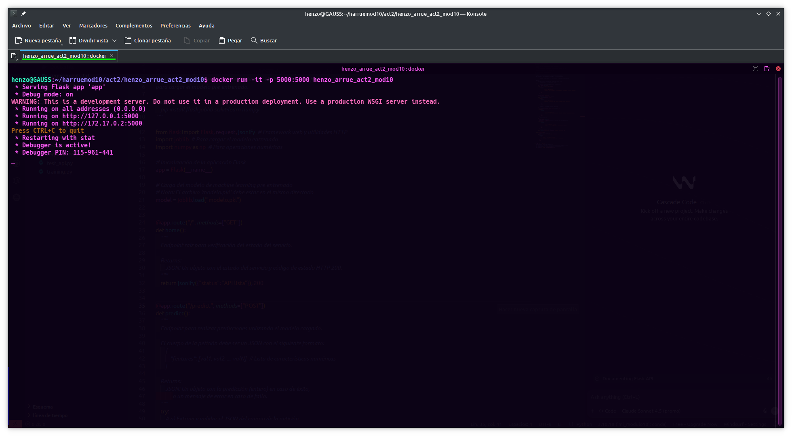
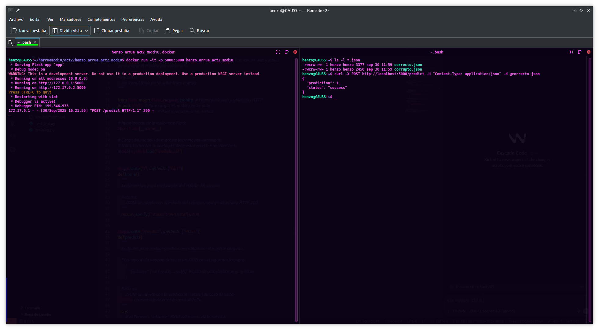
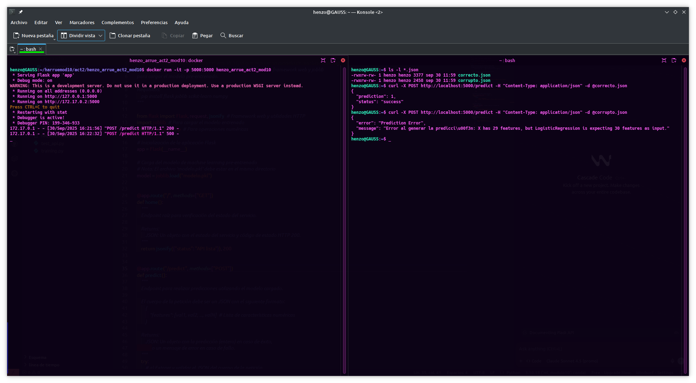
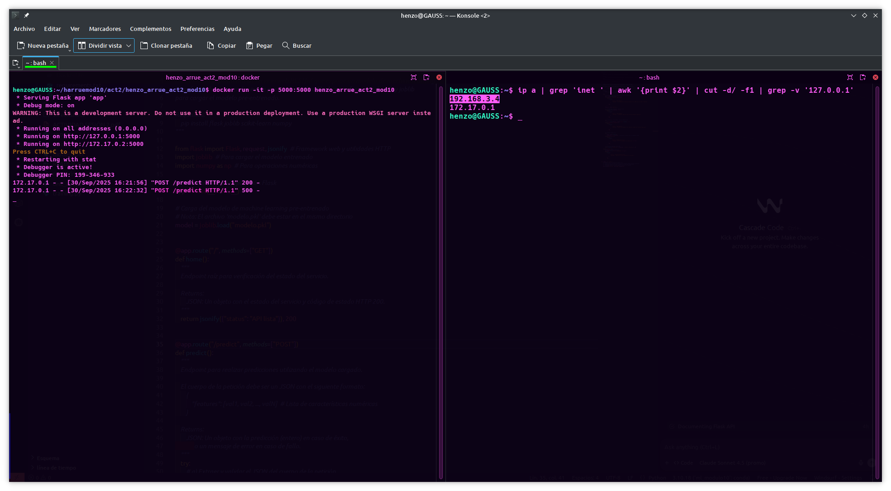
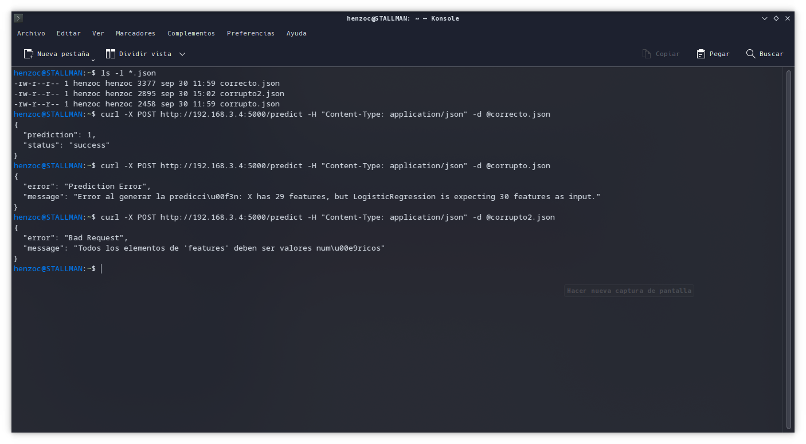

# Actividad 2, Módulo 10

### Contenerización de una API ML con Docker

El presente documento describe el desarrollo de una actividad práctica centrada en la contenerización de una API de machine learning utilizando Docker.
El objetivo principal es aplicar los conocimientos sobre contenedores para construir una API funcional creada con Flask que use un modelo de aprendizaje automático, integrando todo en una imagen Docker lista para ser desplegada.

Para ello, las tareas que conforman esta actividad se desarrollan de la siguiente manera:

## 1.  Entrenamiento del modelo:

    Se seleccionó el dataset load_breast_cancer. A partir de este conjunto de datos se entrena un modelo simple, de clasificación binaria, utilizando el algoritmo estándar LogisticRegression. Una vez entrenado, el modelo se guarda en disco para su posterior uso en la API, en formato pickle (.pkl).

## 2.  Creación de la API REST con Flask:

    Se desarrolla un archivo app.py que implementa una API REST, que contiene dos endpoints. El primero, "/", responde con un mensaje de bienvenida ("API lista") que confirma que la API está funcionando. El segundo endpoint, "/predict", recibe datos en formato JSON mediante una petición POST y utiliza el modelo guardado para generar una predicción que después devuelve en formato JSON. Este diseño permite exponer el modelo para ser consumido por aplicaciones     externas o pruebas.

## 3.  Contenerización con Docker:

    Se crea un archivo Dockerfile que define la imagen Docker a construir. Este Dockerfile contiene las instrucciones necesarias para instalar todas las dependencias del proyecto y ejecutar la aplicación Flask. En caso de requerirlo, se incluyen también un archivo requirements.txt en la raíz con las librerías Python necesarias para facilitar la instalación de dependencias dentro del contenedor.

## 4.  Construcción y ejecución del contenedor:

    Con el Dockerfile preparado, se procede a construir la imagen Docker. Una vez construida, se ejecuta un contenedor mapeando el puerto 5000 del contenedor al puerto 5000 del host, permitiendo acceder a la API a través de ese puerto desde fuera del contenedor. Para validar que la contenerización fue exitosa y que la API funciona correctamente, se realizan pruebas externas con curl, enviando peticiones a los endpoints implementados y comprobando las respuestas.

---

## Pantallazos

### A continuación se presentan pantallazos del proceso de creación de la imagen, contenerización y pruebas.

## 1. Asegurar que Docker no tiene imágenes o contenedores previos.

## 2. Contrucción de la imagen Docker de la API.

## 3. Correr el contenedor con la imagen Docker de la API, mapeado al puerto 5000 en localhost.

## 4. Prueba con archivo en formato json que contiene las features apropiadas . Este archivo se incluye para su revisión.

## 5. Prueba con archivo corrupto en el que intencionalmente se eliminó un dato.

## 6. Obtener dirección ip del equipo en la red local.

## 7. Prueba desde otro equipo de la red local, utilizando los mismo archivos correcto.json y corrupto.json utilizados anteriormente y se agrega un corrupto2.json que tiene una valor no numérico.

### En resumen, la tarea abarca todas las fases esenciales para desplegar un modelo de machine learning en producción mediante el estándar de contenerización Docker, desde la  reación del modelo y API, hasta la generación de una imagen ejecutable y la comprobación del servicio desplegado, se realiza una prueba en red local, lo que muestra que es fácilmente escalable a su utilización en un servidor remoto a través de internet.